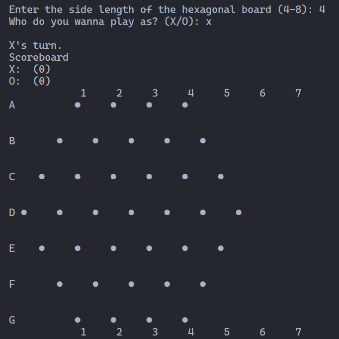
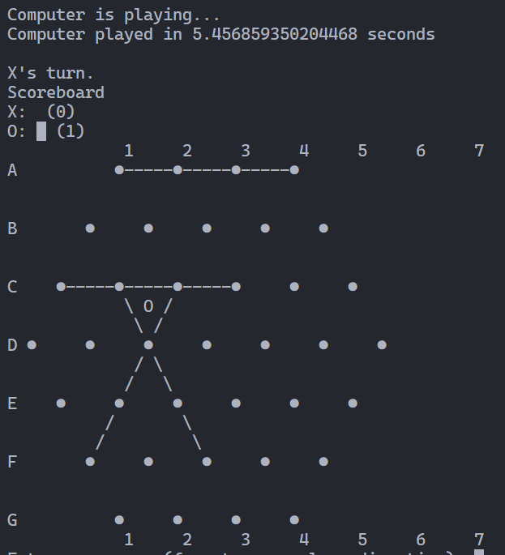
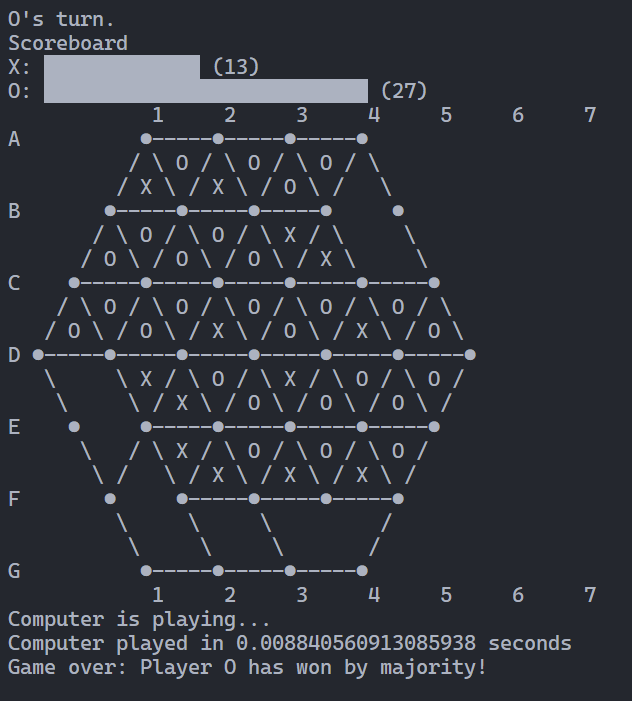
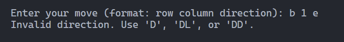
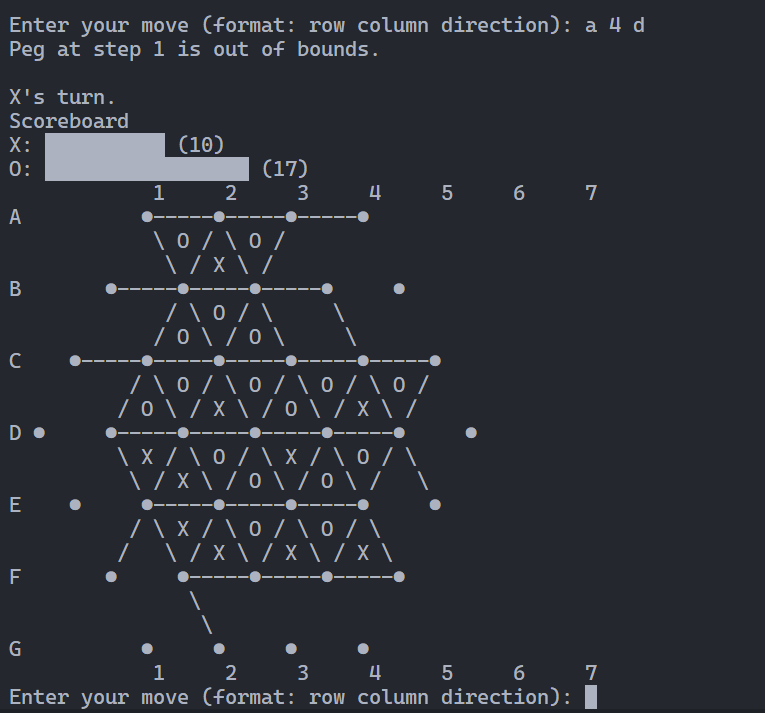
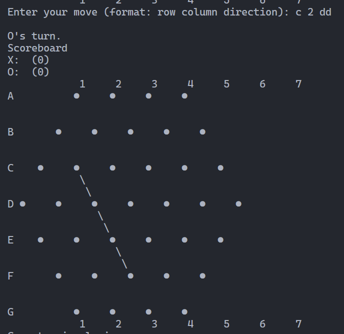

# 🎲 Triggle AI – Console-Based Python Game

A console-based implementation of the board game **Triggle**, where a human player competes against an AI opponent powered by the **Minimax algorithm with alpha-beta pruning**. The game is designed to be both strategic and fun, showcasing AI decision-making in a turn-based setting.

## 🧠 Game Overview

Triggle is a triangular grid-based board game. Each move is defined by a direction:
- `d` – right  
- `dd` – down-right  
- `dl` – down-left  

The goal is to control strategic positions and outmaneuver your opponent—whether you're the human or the algorithm!

## Gameplay Screenshots

### Board

### Computer Move

### Endgame

### Invalid Direction

### Out of Bounds

### User Move

## 🤖 Features

- Human vs. AI gameplay
- Minimax algorithm for AI move selection
- Alpha-beta pruning for performance optimization
- Fully console-based interface
- Game rules and logic based on the original Triggle board game
- 

## 💻 How to Play

1. Clone this repository:
git clone https://github.com/teodorat63/Triggle.git
cd Triggle

2.Run the game:
python main.py

3. Choose board size

4.Use directional commands when prompted:

dl → down-left
dd → down-right
d → right

The AI will respond after your move.

##📜 License
This project is open source and available under the MIT License.
